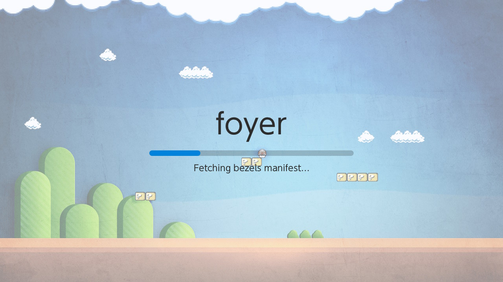
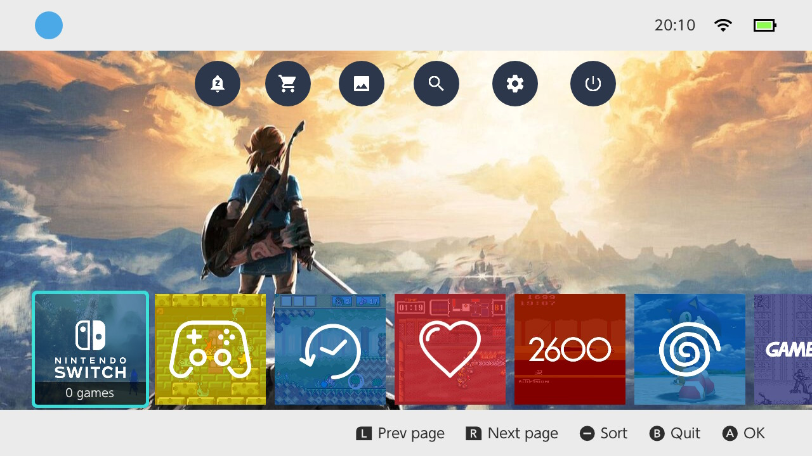
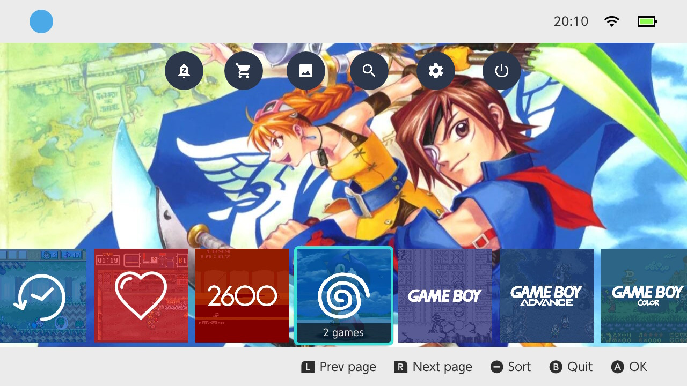
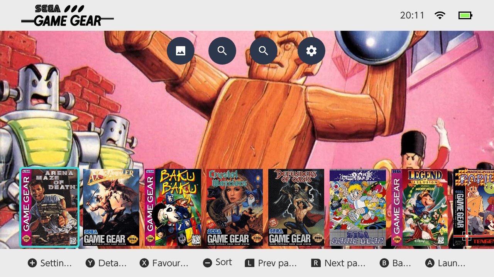
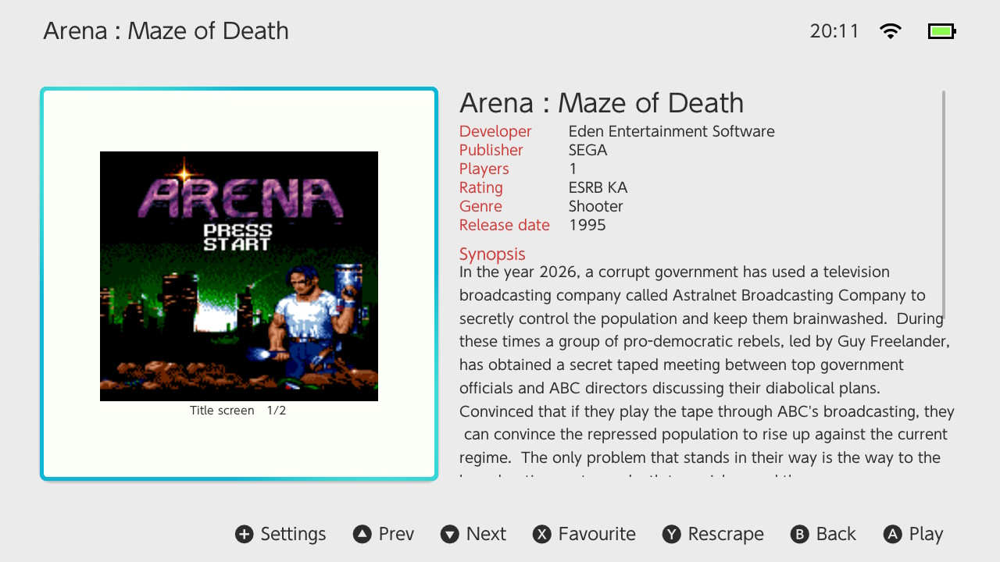
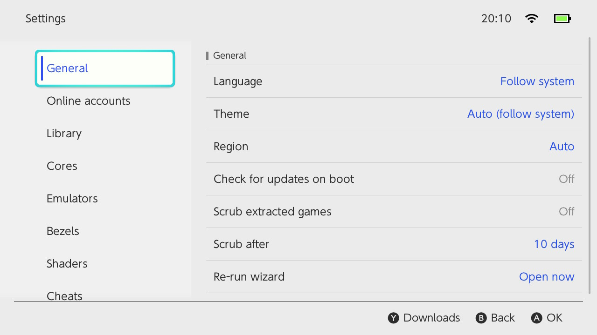
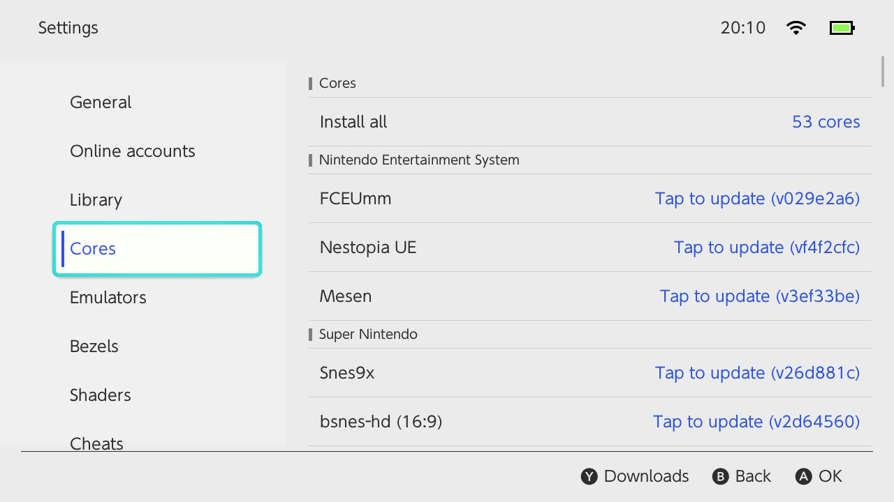
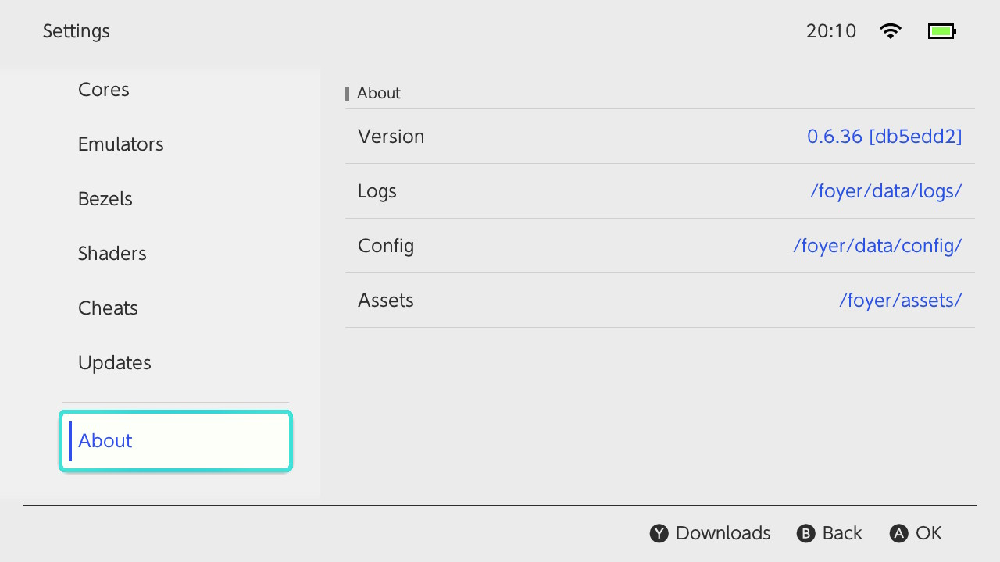

# foyer

Native libretro frontend for Nintendo Switch (CFW only). Browser NRO
for picking systems and games; per-system player NROs that boot the
ROM directly via libretro cores.

**Current line:** 0.6.x — built on
[borealis](https://github.com/XITRIX/borealis) (XITRIX/borealis,
`moonlight_wiliwili` branch). Latest tag: **v0.6.37**. The Phase H
players-on-borealis migration is the default build
(`PLAYER_BRLS=ON`). See [`ROADMAP.md`](ROADMAP.md) for the
phase-by-phase plan.

## Screenshots

| | |
|---|---|
|  <br>Boot splash with per-step manifest progress |  <br>Home carousel — virtual systems (Switch / Favourites / Recent / All Games) |
|  <br>Home carousel — Dreamcast tile focused |  <br>System view — Game Gear box-art grid |
|  <br>Game detail with ScreenScraper metadata + screenshot slideshow |  <br>Settings → General (theme / region / scrub extracted) |
|  <br>Settings → Cores grouped by system |  <br>Settings → About |

## Features

### Browser

- HOS-style launcher chrome (profile cluster, status cluster, action
  buttons, tile carousel) on
  [borealis](https://github.com/XITRIX/borealis).
- Home carousel mixes real systems with **virtual systems** —
  Favourites, Recent, All Games, plus a Switch tile that defers to
  HOS for native titles. Per-tile box art comes from `auto-*`
  splashes bundled in the romfs theme.
- Per-system game list (`SystemActivity`) — sort cycle via `−`
  (Name → Recent → Playtime → Favorites). Round action buttons:
  Scrape, Scan, Search, Settings.
- Per-game detail (`GameActivity`) — ScreenScraper metadata, fanart
  backdrop, screenshot slideshow (Title / Gameplay / Marquee), red
  metadata key labels, in-place refresh when a rescrape finishes.
- Cross-system search activity (`SearchActivity`).
- Per-game settings (`PerGameActivity`) — core override, shader,
  runahead, favourite. Per-system settings (`PerSystemActivity`) —
  default core.
- First-run wizard: pick initial cores / bezel packs / shader packs,
  enter ScreenScraper + SteamGridDB credentials. Downloads run on
  the global install queue while the wizard hands off to Home.
- **Install queue** — one global FIFO. Per-cell "Tap to install" /
  "Tap to re-install" / "Tap to update" labels live-refresh on
  completion. Y from any Settings tab opens the queue overlay with
  progress + pending list.
- **Splash** — pixel-art backdrop, theme-aware overlay, manual
  progress bar that fills as the worker advances through each
  manifest fetch ("Fetching cores manifest…" …).
- Settings tabs: General · Online accounts · Library · Cores ·
  Emulators (default core per system) · Bezels · Shaders · Cheats ·
  Updates · About. The Updates tab splits into four checks —
  foyer self-update / cores / bezels / cheats — each one polls just
  its bucket.
- **Carousel wrap** — left/right at the edge wraps to the opposite
  end on every horizontal Box (in-place patch to brls
  `Box::getNextFocus`).
- libhaze MTP server scoped to `/foyer/roms` only (drop ROMs over
  USB without exposing the rest of the SD card). Settings toggle.
- Self-update: boot-time check fetches `foyer-manifest.json`, modal
  prompt, chain-launches the staged `.new` directly on user-
  confirmed restart; next boot atomically promotes it.
- HOS power slide-in (Sleep / Restart / Power off / Reboot to
  Hekate).
- Profile avatar + nickname pulled from the active libnx account
  (`accountsService`).
- i18n catalogue (en-US / es / pt-BR) — both brls's UI strings and
  foyer's own (`romfs:/i18n/<locale>/foyer.json`,
  `hints.json`).
- Live HOS Light/Dark theme tracking (`setsysGetColorSetId`
  polled once a second).
- Scrub extracted .zip games — off by default; configurable
  threshold (3 / 7 / 10 / 14 / 30 / 60 days).
- Box-art scrapers: libretro-thumbnails (free), ScreenScraper (auth),
  SteamGridDB (auth) — picked by `general.jsonc`.

### Player (per-core NRO)

- Built on borealis since 0.6.29 (`PLAYER_BRLS=ON` default). Boots
  the ROM directly, no browser overhead.
- Audio via `audrv` at the core's reported sample rate.
- **Pause overlay** with full HOS-style chrome (top + bottom bars,
  clock / wifi / battery, theme-color title). `L3 + R3` opens it.
- From the overlay: Save / Load state (slot picker with timestamps,
  Quick + 1–9), Display (aspect mode picker), Shaders (preset
  picker), Core options (SelectorCell per `CoreOption`), Cheats
  (BooleanCell per cheat), Quit (chain-launches back to
  `foyer.nro`).
- **Bezels** rendered from the ScreenScraper bundle
  (`/foyer/assets/system/<sys>/<stem>/bezel-16-9(*).png`); fall
  back to a per-system override under `/foyer/bezels/`.
- SRAM persistence across .zip extract via the rom-basis sidecar
  path (`fe.set_sram_basis_path`).
- RetroAchievements via
  [rcheevos](https://github.com/RetroAchievements/rcheevos) —
  login from `accounts.jsonc`, unlock toasts, server-side
  reporting.
- Cancellation-safe libretro frontend
  (`shared/libretro/frontend.{cpp,hpp}`) — set_video_sink /
  set_audio_sink / poll_input wiring is shared with the legacy
  player path.

## Layout on SD

```
/switch/foyer/foyer.nro                  # browser (install here)
/foyer/
├── content/                             # everything the install queue writes
│   ├── cores/foyer-<core>.nro           # downloaded core players
│   ├── bezels/<sys>.png                 # per-system bezel fallback
│   ├── shaders/<preset>/                # libretro shader presets
│   └── cheats/<sys>/                    # cheat packs
├── data/
│   ├── first_run_complete               # marker — written by wizard's Finish
│   ├── session.json                     # last-played, recent list
│   ├── skipped_versions.json            # "skip this version" picks
│   ├── switch_titles.cache              # NACP icon cache (legacy)
│   ├── extract/                         # extracted-zip cache (LRU-scrubbed)
│   ├── cache/
│   │   ├── library.cache.json           # scanner cache (delta-rescan fast path)
│   │   └── libretro_index/v2/           # libretro-thumbnails index cache
│   ├── config/
│   │   ├── general.jsonc                # rom_root, language, theme, region, …
│   │   ├── accounts.jsonc               # ScreenScraper / SteamGridDB / RA creds
│   │   └── per_game.jsonc               # per-rom core / shader / favourite
│   └── logs/<YYYY-MM-DD_HH-MM-SS>.log   # per-run log files
├── assets/
│   ├── system/<sys>/<stem>/             # per-game ScreenScraper bundle:
│   │   ├── metadata.json                #   developer / publisher / synopsis / …
│   │   ├── sstitle(<region>).png        #   title screen
│   │   ├── ss(<region>).png             #   gameplay shots
│   │   ├── box-2D(<region>).png         #   box art
│   │   ├── bezel-16-9(<region>).png     #   per-game bezel (consumed by player)
│   │   ├── fanart.jpg                   #   detail-view backdrop
│   │   └── screenmarquee(<region>).png  #   marquee
│   ├── covers/<sys>/<stem>.png          # legacy cover path (still read)
│   ├── backgrounds/<sys>/<stem>.jpg     # legacy detail backdrop
│   └── systems/<sys>.{png,jpg}          # per-system splash override
├── roms/<system>/<file.ext>             # rom root (configurable)
├── saves/<system>/                      # libretro SRAM
├── states/<system>/<stem>.<slot>.state  # save states (slots 1–9 + quick)
└── system/<system>/                     # BIOS / firmware
```

Legacy flat paths (`/foyer/cores/`, `/foyer/bezels/`, `/foyer/shaders/`,
`/foyer/cheats/`) survive on disk for installs that predate the
`/foyer/content/` reorg; the current install queue writes to
`/foyer/content/*` exclusively, and a one-shot scrub in
`self_update.cpp` cleans up the legacy `/foyer/content/bezels/
default.png` shipped by older browsers.

Bundled inside `foyer.nro` (`romfs:/`):

```
romfs:/
├── splash_bg.png                            # pixel-art splash backdrop
├── splash.jpg                               # legacy splash (still bundled)
├── themes/foyer/systems/<folder>/
│   ├── splash.png                           # alekfull-NX tile art
│   ├── background.jpg                       # retrofix-revisited app backdrop
│   ├── logo_light.png / logo_dark.png
│   └── auto-{favorites,lastplayed,allgames}/  # virtual-system splashes
│       └── __switch/                          # native Switch tile art
├── shaders/{fill_vsh,fill_aa_fsh,fill_fsh}.dksh   # brls renderer shaders
├── i18n/<locale>/{foyer,brls,hints}.json
├── img/actions/{news,eshop,gallery,search,settings,power}.png
├── xml/activity/{home,system,game,foyer_settings,splash,…}.xml
├── xml/tabs/foyer_settings.xml
└── material/MaterialIcons-Regular.ttf
```

## Theme

0.6.x ships a single bundled theme tree
(`romfs:/themes/foyer/`) combining alekfull-NX tile splashes with
retrofix-revisited per-system app backdrops. brls owns the rest of
the chrome (Light or Dark, picked from the Switch system theme
automatically via `setsysGetColorSetId`).

Settings → General → Theme overrides the system default (Auto /
Light / Dark). `theme_watcher` polls once per second so toggling
the system theme takes effect without relaunching foyer.

The 0.5.x JSONC theme system + the multi-palette picker are gone;
brls's HOS-faithful theme is the source of truth.

## Cores

A system can declare multiple cores in
`shared/library/system_db.cpp`; the first entry is the default.
Resolution at launch:

1. Per-game override in `/foyer/data/config/per_game.jsonc`
   (`{ "<rom path>": { "core": "<name>" } }`)
2. Per-system override in `general.jsonc`
   (`default_core_per_system: { "<folder>": "<name>" }`)
3. The system's first declared core

Player NROs are downloaded from
[`foyer-cores`](https://github.com/foyer-frontend/foyer-cores)'s
release manifest. The first-run wizard offers checkboxes for the
manifest's cores; Settings → Cores groups them by system and
exposes per-row "Tap to install / re-install / update".

```sh
# Build a single player binary:
cmake --preset Player-fceumm
cmake --build --preset Player-fceumm
# → build/Player-fceumm/foyer-fceumm.nro

# Build the whole rotation locally:
cmake --preset Players-All
cmake --build --preset Players-All
```

The current live core list is in
[`foyer-cores/manifest.json`](https://github.com/foyer-frontend/foyer-cores/releases/latest)
(~55 cores at the latest tag). Foyer's `system_db.cpp` knows about
every system regardless of which cores happen to be installed.

### Release cadence

foyer-cores uses **CalVer** tags (`YYYY.MM.DD[.NN]`):

- **Nightly cron @ 03:00 UTC** — smart-matrix build. Each core's
  upstream is probed via `git ls-remote`; only cores whose
  upstream or recipe file changed actually rebuild. The carry-
  forward manifest aggregator inherits the prior release's URL
  for skipped cores, so every published manifest still lists
  every core.
- **Manual tag push** (e.g. `2026.05.20`) — force-rebuilds the
  whole matrix.
- **Cross-repo trigger** — any commit on `foyer/main` that
  touches `shared/**` or `player/**` fires a
  `repository_dispatch` at foyer-cores, which then cuts a fresh
  CalVer tag and force-rebuilds.

## Build

Requires devkitPro with `switch-dev`, `switch-curl`, `switch-glm`,
`switch-glfw`, `switch-zlib`, `switch-mbedtls`, `deko3d`,
`switch-mesa`, `switch-libdrm_nouveau`, `switch-glad`,
`switch-ffmpeg`. CMake ≥ 3.21 (FetchContent's `SOURCE_SUBDIR`).

```sh
export DEVKITPRO=/opt/devkitpro
export DEVKITA64=/opt/devkitpro/devkitA64
export PATH=$DEVKITPRO/tools/bin:$DEVKITA64/bin:$PATH

# Browser
cmake --preset Release
cmake --build build/Release -j$(nproc)
# → build/Release/foyer.nro

# Player (one core per build)
cmake --preset Player-fceumm
cmake --build --preset Player-fceumm
# → build/Player-fceumm/foyer-fceumm.nro
```

`FOYER_CORES_DIR` defaults to `${CMAKE_SOURCE_DIR}/../foyer-cores`
(sibling clone of the recipes repo). Override when working off a
fork.

First configure clones
[`XITRIX/borealis`](https://github.com/XITRIX/borealis) on the
`moonlight_wiliwili` branch (~50 MB) plus brls's vendored fmt /
yoga / tweeny / tinyxml2 / libretro-common subset, then applies a
small in-place patch to `Box::getNextFocus` for the carousel-wrap
behaviour. Subsequent configures are fast.

## License

GPLv3. See [`LICENSE`](LICENSE).

Theme art:
[`alekfull-nx`](https://github.com/anthonycaccese/alekfull-nx-es-de)
splashes and
[`retrofix-revisited`](https://github.com/anthonycaccese/retrofix-revisited-es-de)
backgrounds, both **CC BY-NC-SA 4.0**.
